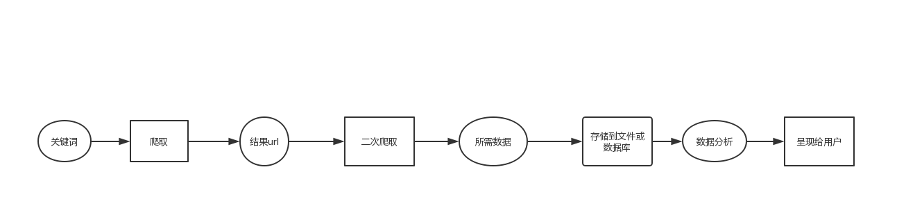

# 基于python爬虫的大创项目
## 项目第一主持人
> 1405170203 夏芳冰
## 项目组人员
> xxx
## 项目名称
> 基于python的网络爬虫系统
## 项目简介  
> 基于python语言进行网络爬虫，通过用户输入的关键词先进行搜索引擎的爬取，对搜索结果页面的有效url进行二次爬取，将获取的数据进行数据分析后，按用户需求，呈现给用户。
# 1.申请理由
> 我有python语言和网络爬虫的知识基础，上一学年成功参与了一个大创项目，积攒了相关经验。我对于网络爬虫很感兴趣，擅于学习，作为计软专业的学生，已经学习过多种编程语言和专业知识等相关内容，具有专业的编程能力和思维，有信心也有决心来完成这个项目。
## 2.项目方案
### 1、项目研究背景
> 爬虫在搜索引擎中比较普遍，比如Google、百度。虽然网络中的信息越来越多，越来越复杂，搜索引擎却可以针对某一关键词进行全网搜索，但是他们程序的技术一般都不公开，除此之外，庞大的搜索引擎最终显示的结果是全网络遍历结果的最优解，而很难做到有效搜索针对网站针对关键词的搜索，搜索结构中常常还会存在广告网页，而且搜索引擎为了节约搜索速度，较多使用底层的高级语言编写，庞大且复杂，不适合作为参考对象。    
> 目前几种比较常用的爬虫实现策略：广度优先的爬虫程序，Repetitive爬虫程序，定义爬行爬虫程序。此外，还有根据概率论进行可用Web页的数量估算，用于评估互联网Web规模的爬虫程序；采用爬行森都、页面导入链接量分析等方法；限制从程序下载不想管的Web页的选择性爬行程序等等。Google的部分爬虫程序就是基于python的，由于python自身的限制，更多是作为一种粘合剂配合其它语言编写的内核运行。    
> 由于学校内，教师常常需要思政内容的查询，并且还没有相关企业或者人员从事相关开发，使用搜索引擎查询出的结果往往要用户自己来判断网页的性质、内容的相关性，浪费用户的时间精力。在这种情况下，使用针对性设计的网络爬虫来获取教师所需要的思政相关内容，是一个不错的选择，不同于搜索引擎，网络爬虫是一个自动获取网页的程序，可以有效的抓取针对性网页的数据内容，进行数据分析，根据用户的不同需求，呈现给用户，并且可以自动保存在本地，方便使用。    
> 本项目成员均有python网络爬虫的知识基础以及实践经验，爬取过搜索引擎、淘宝、京东，新闻，电影影评，图片库，小说等内容，根据小说的章节，通过数据分析，做过词频图等等，阅读过大量的网络爬虫相关文献，已具备网络爬虫的基本技术。    
> 本项目现在可以根据关键词爬取搜索引擎，并获取搜索结果中的url，可以分别爬取动态和静态页面获取数据，遇到的难点在于对获取的url进行二次爬取，同时爬取结构完全不同的多个网页，获取用户所需的数据。
### 2、项目研究目标及主要内容
> 根据用户输入的关键词，先进行对搜索引擎爬取，对搜索结果页面中的广告页面等无效页面进行筛除，再对搜索结果进行二次爬取，将获取的内容存入本地，进行数据分析，可实现数据可视化等等操作，根据用户的需求，进行数据的呈现。
### 3、项目创新特色概述
> 项目的创新点在于二次爬取，同时对网页结构不同的网站进行爬取并且获取有效数据。
> 现在大部分的爬虫项目都是爬取指定某个网站，网页结构固定，即便是二次爬取，也是同一网站下的相同规格的网页，而不是同时爬取不同规格的网页。本项目的创新点就在于此。
### 4、项目研究技术路线
> 
### 5、研究进度安排
> 2019.11.1~2019.12.15项目准备阶段    
> 明确研究任务和研究目标,与指导教师进行沟通，对本项目的研究内容进行全面和深入的理解、掌握,充分阅读国内外文献，收集整理资料，对涉及到的爬虫技术进行深入学习。   
> 2019.12.20~2020.4.20项目前期阶段   
> 完成项目的基础功能，将本项目中的难点解决，使得项目初步成型并且可以使用。   
> 2020.4.20~2020.8.20项目中期阶段   
> 完善并且优化项目功能，在完成功能后，进行项目的界面编写，方便用户操作，使用感更佳。   
> 2020.8.20~2020.10.31项目后期阶段   
> 项目的前后端均完成，对项目进行多次优化，使得这个系统更加完善。   
### 6、项目组成员分工
> 夏芳冰负责主要程序的编写，项目整体流程的把控和规划。   
> XXX负责检查代码，查阅相关文献，对项目提供见解和意见，撰写报告。
## 3. 学校提供条件
> 项目开展，学校提供了实验室供我们研究项目，提供大学生创新创业训练项目经费对项目的开展进行经费支持，也提供了相关的扶持政策以便于我们开展并完成项目。
## 4. 预期成果
> 基于python网络爬虫技术，完成整个系统的功能，使之成为一个完整且有意义的项目，定期完成实验日志，记录心得体会，顺利提交中期报告和结题报告，完成项目。
